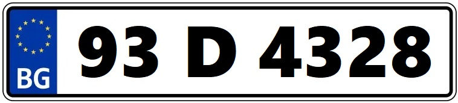
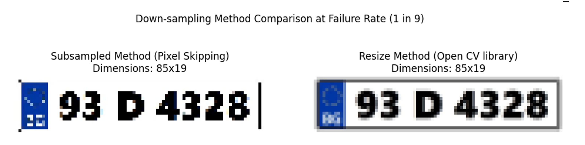
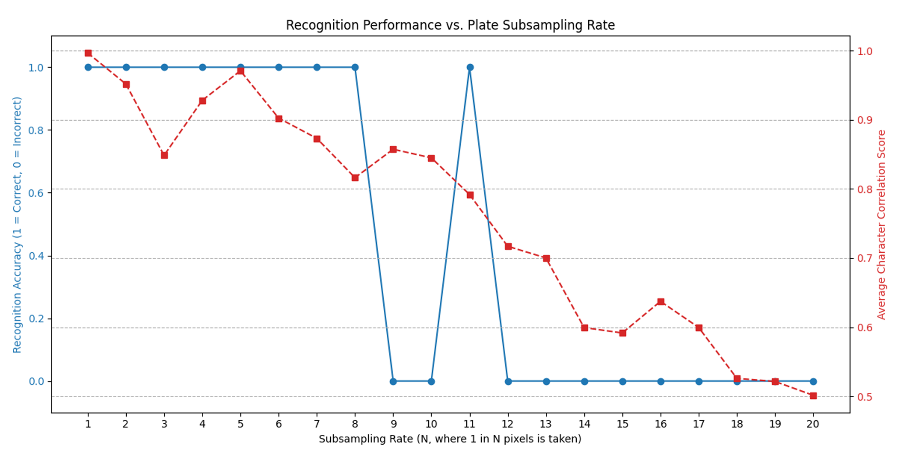

# License Plate Recognition using 2D Correlation & Sampling Analysis 🚗

This project implements a License Plate Recognition (LPR) system based on **Signal Processing** concepts. Unlike modern AI approaches, this project utilizes **2D Cross-Correlation** for template matching and analyzes the robustness of the system against **Spatial Downsampling** and **Aliasing**, demonstrating the practical implications of the Nyquist-Shannon sampling theorem.

Developed as part of the **Signals and Systems** course at **Sharif University of Technology**.

## 📄 Project Documentation
For a detailed theoretical analysis, sampling theorem, and recognition results, please refer to the full report:
👉 **[Download Full Project Report (PDF)](Project report.pdf)**

## 📄 Project Overview
The project consists of two main modules:
1.  **Ideal Case Recognition (ideal.py):** Segmentation and recognition of characters from high-quality plate images using template matching.
2.  **Resolution Analysis (ideal_resize_analysis.py):** Investigating the impact of lowering image resolution (Downsampling) on recognition accuracy to find the system's breaking point.

## 🛠 Algorithms & Techniques

### 1. Character Segmentation (`ideal.py`)
The system isolates characters from the license plate using classical image processing techniques:
* **Preprocessing:** Grayscale conversion and Binary Inversion (Thresholding).
* **Contour Detection:** Using `cv2.findContours` to identify character boundaries.
* **Filtering:** Validating characters based on Aspect Ratio and Height constraints.
* **Padding:** Adding a border to segmented characters to match template dimensions.

### 2. Character Recognition (2D Correlation)
Recognition is performed by calculating the **Normalized Cross-Correlation** between the segmented character and a set of reference templates (0-9, A-Z).

The mathematical basis for similarity score:
$$R(x,y) = \frac{\sum_{x',y'} (T(x',y') \cdot I(x+x', y+y'))}{\sqrt{\sum_{x',y'} T(x',y')^2 \cdot \sum_{x',y'} I(x+x', y+y')^2}}$$

Where $T$ is the template and $I$ is the image segment. The template yielding the highest correlation coefficient ($r \approx 1.0$) is selected.

### 3. Sampling Rate Analysis (`ideal_resize_analysis.py`)
We simulate low-quality sensors by **Downsampling** the images (Decimation) without anti-aliasing filters.
* **Method:** Keeping 1 pixel out of every $N$ pixels (`image[::N, ::N]`).
* **Goal:** To observe the effects of **Aliasing** on character shapes and correlation scores.

## 📊 Results & Visualization

### Successful Recognition
The system successfully segments and identifies characters with high confidence in ideal conditions.

| Input Plate | Segmented Characters | Recognized String |
| :---: | :---: | :---: |
|  | *(See segmented folder)* | **93D4328** |

### Robustness Against Downsampling
As the downsampling rate increases ($N$), the image resolution drops. We identified a **Breaking Point** where the correlation score drops significantly, leading to recognition failure due to loss of high-frequency edge information.

*Fig: Recognition Accuracy vs. Subsampling Rate. Note the sharp drop at 1-in-9 pixels.*

*Fig: Visual artifacting (Aliasing) in Subsampled image vs. Interpolated Resize.*

## 📂 Project Structure
* `ideal.py`: Main logic for segmentation and correlation-based recognition.
* `ideal_resize_analysis.py`: Script for iterative downsampling and performance benchmarking.
* `numbers/`: Reference templates for digits and letters.
* `ideal/`: Source images of license plates.
* `Project report.pdf`: Detailed theoretical explanation and observations.

---
*Tech Stack: Python, OpenCV, NumPy, Matplotlib*
